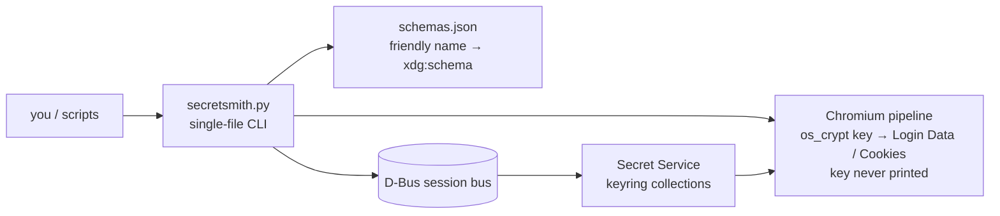

# secretsmith

<div align="right">

[](secretsmith.py)
[](bin/secretsmith)
[](#layout)

</div>

**Maximal freedesktop Secret Service CLI. The `secret-tool` that can't miss.**

Fork lineage: [GNOME/libsecret](https://github.com/GNOME/libsecret) (`secret-tool`), forked to [toxicwind/libsecret](https://github.com/toxicwind/libsecret) — `secretsmith` reimplements and maximalizes `secret-tool`'s D-Bus semantics in Python.

---

## Why secretsmith?

Born from a real bug: a Chromium `os_crypt` key lookup filtered on `xdg:schema org.freedesktop.Secret.Generic` — **a schema Chromium never uses** — and came back empty. `secretsmith` makes that impossible:

- 🔎 **Default search has no schema filter** — the original bug cannot happen
- 📇 **Schema registry** (`schemas.json`) — `--schema chromium` resolves to the real schema; `chrome` is an alias; `generic` is explicitly documented as *not* what Chromium uses
- 🙈 **Secrets are never printed without `--show`** — listings show `<redacted: N bytes>`; binary secrets print as base64 under `--show`
- 🚫 **The Chromium os_crypt key is never printed on any path** — not with `--show`, not as JSON; `get`/`search --show` on such an item is refused *before* the secret is even fetched
- ⌨️ **`set` reads from stdin/`--secret-file`, never argv** — no `ps` leakage
- 🧪 **JSON mode for everything** — `secretsmith --json search --schema chromium` is fully scriptable

## How it works



`bin/secretsmith` is the launcher (symlink it onto PATH); it defaults `DBUS_SESSION_BUS_ADDRESS` to the user's session bus when unset.

## Quick start

```bash
ln -sf /home/toxic/sovereign/projects/mesh/secretsmith/bin/secretsmith ~/.local/bin/secretsmith
secretsmith check
secretsmith search --schema chromium
```

`check` verifies service reachability, default collection unlocked, and the Chromium entry readable — key metadata only (byte count, AES key candidates), **never the raw key**.

## Usage

```bash
# health: service reachable, default collection unlocked, Chromium entry readable
secretsmith check

# search everything (no schema filter — the original bug is impossible)
secretsmith search --attr application=chromium

# schema-aware search via the registry
secretsmith search --schema chromium
secretsmith search --schema generic --attr foo=bar

# get exactly one item (errors on 0 or >1 matches)
secretsmith get --attr xdg:schema=org.freedesktop.Secret.Generic --show

# store (secret from stdin or --secret-file; never from argv)
echo -n "s3cr3t" | secretsmith set --label "my api key" --attr service=example
secretsmith set --label k --attr service=ex --secret-file /run/key --replace

# delete (two-step unless --yes)
secretsmith delete --attr service=example --yes

# collections
secretsmith collections
secretsmith collection-create ops --alias default
secretsmith lock default / unlock default

# registry
secretsmith schemas

# Chromium/Chrome os_crypt pipeline (the use case that started this)
secretsmith check                        # key metadata: byte count, AES key candidates
secretsmith chromium-logins              # decrypt ~/.config/chromium/Default/Login Data
secretsmith chromium-logins --profile-dir /path/to/profile --show
secretsmith chromium-cookies

# JSON mode for everything (scriptable)
secretsmith --json search --schema chromium
```

### Schema registry

`schemas.json` maps friendly names to `xdg:schema` values. `chrome` is an alias of `chromium` (`chrome_libsecret_os_crypt_password_v2`); `generic` is `org.freedesktop.Secret.Generic` — explicitly documented as *not* what Chromium uses. Unregistered raw schema strings still work but warn.

### Compat shim

`compat-chromium-keyring.sh` is the source of the old `/home/toxic/.local/bin/chromium-keyring` stopgap, now a thin shim over secretsmith (`check` → `secretsmith check`, `attrs` → `secretsmith search --schema chromium`). The old `key` subcommand was removed — the raw os_crypt secret is never printed. One truth lives in secretsmith; the shim exists for muscle memory only.

## Config

| Item | Purpose |
|---|---|
| `schemas.json` | known-schema registry: friendly name → `xdg:schema` (edit to add your own) |
| `DBUS_SESSION_BUS_ADDRESS` | session bus; `bin/secretsmith` defaults it to the user's session bus when unset |
| `bin/secretsmith` | launcher — symlink `~/.local/bin/secretsmith` → this file |

Deps: `python3`, `dbus-python`, `cryptography` (for the Chromium pipeline).

## Layout

```
secretsmith/
├── secretsmith.py   # the CLI (single file)
├── schemas.json     # known-schema registry
├── bin/secretsmith  # launcher (PATH install target)
├── tests/test_secretsmith.py
└── README.md
```

## Development

```bash
python3 -m unittest discover -s tests -v          # unit tests (no keyring needed)
SSM_TEST_KEYRING=1 python3 -m unittest discover -s tests -v   # + live D-Bus integration
```

The integration test creates a throwaway collection, round-trips an item, and deletes the collection.

## License & security

- **License:** this repository currently ships **no LICENSE file** — no license grant is stated, so check with the repo owner before reusing the code. (Adding one is an open item.)
- **Security:** secrets are never printed without `--show`; listings redact to `<redacted: N bytes>`; `set` never takes secrets via argv; and the Chromium `os_crypt` key (`secret_is_key` schemas in `schemas.json`) is never printed on any path — decrypt operations (`chromium-logins`, `chromium-cookies`) consume the key internally and never emit it.
